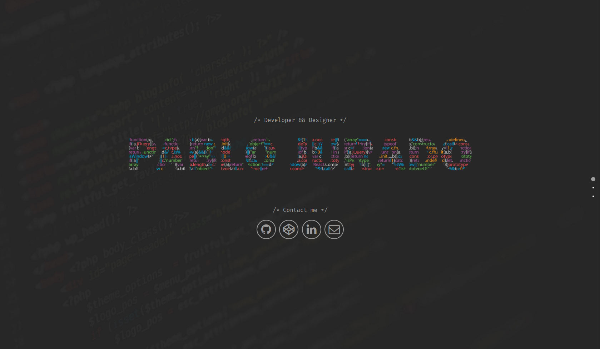

# Portfolio 2017

Hi there! my name is Pablo Jurado I am a developer/designer from Houston.
I like to redesign my portfolio every year just for fun and to try new libraries.

[Link](http://pablojurado.com/)



## Tech/framework used

Built with:
* [html5 boilerplate](https://github.com/h5bp/html5-boilerplate)
* Flexbox
* Sass
* jQuery
* [Onepage scroll](https://github.com/peachananr/onepage-scroll)
* [Velocity](https://github.com/julianshapiro/velocity)
* Grunt

## Development Setup

```sh
# install node_modules
npm install

# install grunt
npm install -g grunt-cli

# watch all the js and sass files with grunt
grunt
```

## Credits

[Pablo Jurado](https://github.com/pablo-jurado)
